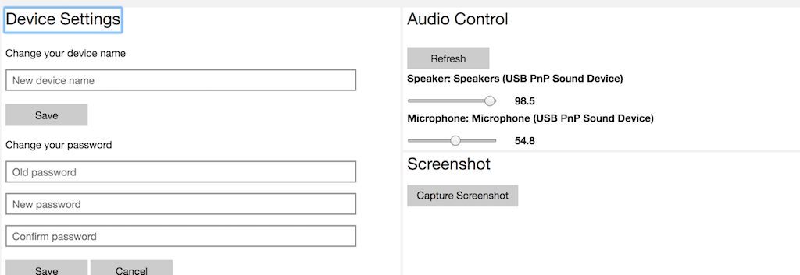

# Phodal's Smart Home

目录

  * [介绍](#介绍)
  * [ESP8266 仿真设备](#esp8266-仿真设备)
     * [ESP8266 仿真 Wemo](#esp8266-仿真-wemo)
     * [ESP8266 仿真 Philips Hue](#esp8266-仿真-philips-hue)
  * [小米智能插座](#小米智能插座)
  * [Raspberry Pi Home Assistant](#raspberry-pi-home-assistant)
  * [Home Assistant Broadlink PM PRO](#home-assistant-broadlink-pm-pro)
     * [获取 Broadlink 配置](#获取-broadlink-配置)
  * [Homebridge](#homebridge)
     * [安装 Homebridge](#安装-homebridge)
     * [开机启动](#开机启动)
  * [HomeBridge 集成 Home Assistant](#homebridge-集成-home-assistant)
  * [Amazon Echo 设置](#amazon-echo-设置)
  * [结合 HomeAssisatant 和 Amazon Echo](#结合-homeassisatant-和-amazon-echo)
     * [只开关设备](#只开关设备)
  * [Raspberry Pi Cornata](#raspberry-pi-cornata)

介绍
---

视频演示地址：[腾讯视频](https://v.qq.com/x/page/r0512ss7xc9.html)


### Amazon Echo

### Home Assistant

### HomeBridge

> HomeKit 是由 Apple 公司推出的智能家居平台，包括iOS 上的 SDK、智能家居硬件通信协议 (HAP: HomeKit Accessory Protocol) 、以及 MFi(Made for iPhone/iPod/iPad) 认证等等。

借助于 iPhone、iPad、iWatch 等设备及『家庭』应用，用户可以轻松地掌控各种 HomeKit 配件。并且可以通过设备上 Siri 应用、Homepod，直接用语音来与设备交互。

当前要在 Homekit，有三种方法：

 - 购买昂贵的 MFi 设备。
 - 借助于 Home Assistant，来自建 Homekit API 服务连接设备。
 - 模拟现有的 MFi 设备。诸如使用 ESP8266 仿真 Philip Hues。

引自：[使用iOS Homekit控制树莓派](http://caoyudong.com/2017/01/10/%E4%BD%BF%E7%94%A8iOS-Homekit%E6%8E%A7%E5%88%B6%E6%A0%91%E8%8E%93%E6%B4%BE/)：HAP 协议部分是需要加入 MFi Program 才能获取文档，而且 MFi Program 无法以个人开发者身份加入。

这个时候我们就需要借助于 Homebridge

Homebridge 是一个用 Node.js 实现的轻量级后台，可以在家庭网络上运行，用于模拟iOS HomeKit API。 它支持插件——由社区提供的模块，这些插件能提供从 HomeKit 到 “智能家居” 设备制造商，提供的各种第三方API的基本桥梁。

### 仿真设备

### 项目介绍 

设备：

 - Amazone Echo Dot
 - NodeMCU
 - Broadlink RM Pro
 - Yeelight
 - Raspberry Pi 2
 - Android、iOS 设备

Tools:

 - [Alexa Skill Testing Tool](https://echosim.io/)
 - [Raspberry Pi Burn images Tools](https://etcher.io/)

ESP8266 仿真设备
---

 - Wemo：可以被 Amazon Echo 识别
 - Philips Hue：可以被 HomeKit 识别 ?

### ESP8266 仿真 Wemo

**要求**：下载 Ardunio IDE，地址： [http://www.arduino.cc/en/main/software](http://www.arduino.cc/en/main/software)

一、安装 Arduino ESP8266

Arduino ESP8266 GitHub 地址： [https://github.com/esp8266/Arduino](https://github.com/esp8266/Arduino)

安装方法：

1. 启动 Arduino IDE，并进入 ``Preferences`` 窗口
2. 在 Additional Board Manager URLs 中输入： ``http://arduino.esp8266.com/stable/package_esp8266com_index.json``
3. 从 Tools > Board  菜单中打开 Boards Manager，并输入安装 esp8266 平台

二、测试仿真

下载安装包：[https://github.com/kakopappa/arduino-esp8266-alexa-multiple-wemo-switch](https://github.com/kakopappa/arduino-esp8266-alexa-multiple-wemo-switch)

Setup 步骤：

 - 下载代码
 - 在编辑器中打开 wemos.ino
 - 修改 WiFi 设置
 - 定义开关及其回调，在 ``officeLightsOn``、``officeLightsOff``、``kitchenLightsOn``、``kitchenLightsOff`` 中
 - 烧录

相似项目 Arduino Esp8266 Alexa Wemo switch emulator：https://github.com/witnessmenow/esp8266-alexa-wemo-emulator

### ESP8266 仿真 Philips Hue

ESP8266 Hue Emulator 项目地址：[ESP8266HueEmulator](https://github.com/probonopd/ESP8266HueEmulator)

这个 Demo 需要这么几个库``NeoPixelBus``、``aJson``、``Time``、``NtpClient``，同时还需要修改一些相关的配置。

因此直接使用这个脚本安装，比较简单：

**注意**：如果是 Mac OS，需要将下面脚本中的 ``$HOME/Arduino/libraries/`` 改为 ``$HOME/Documents/Arduino/libraries/``

```
mkdir -p $HOME/Arduino/libraries/
cd $HOME/Arduino/libraries/
git clone --branch 2.1.4 https://github.com/Makuna/NeoPixelBus.git
git clone https://github.com/interactive-matter/aJson.git
git clone https://github.com/PaulStoffregen/Time.git
git clone https://github.com/gmag11/NtpClient.git
sed -i -e 's|#define PRINT_BUFFER_LEN 256|#define PRINT_BUFFER_LEN 4096|g'  aJson/aJSON.h
cd -
git clone https://github.com/probonopd/ESP8266HueEmulator.git
sed -i -e 's|#include "/secrets.h"|//#include "/secrets.h"|g' ESP8266HueEmulator/ESP8266HueEmulator/ESP8266HueEmulator.ino
sed -i -e 's|//const char|const char|g' ESP8266HueEmulator/ESP8266HueEmulator/ESP8266HueEmulator.ino
```

再将代码烧录到 ESP8266 上，就可以在 Homekit 看到相应的配置。

小米智能插座
---

寻找设备

```
npm install -g miio
miio --discover
```

```
npm install --save miio
```

Raspberry Pi Home Assistant
---

Images: [https://home-assistant.io/docs/hassbian/installation/](https://home-assistant.io/docs/hassbian/installation/)

Images Downloader: [https://etcher.io/](https://etcher.io/)

发现文档好像有点问题，便手动地尝试安装：

```
pip3 install --upgrade homeassistant
```

运行

```
sudo -u homeassistant -H /srv/homeassistant/bin/hass
```

并不没工作，于是执行官方的安装脚本：

```
curl -O https://raw.githubusercontent.com/home-assistant/fabric-home-assistant/master/hass_rpi_installer.sh && sudo chown pi:pi hass_rpi_installer.sh && bash hass_rpi_installer.sh
```

又在我的 MBP 上安装尝试

```
pip3 install homeassistant
hass --open-ui
```

然后发现安装完就可以了。

Home Assistant Broadlink PM PRO
---

在 ``configuration.yaml`` 文件中添加下面的配置：

```
# Example configuration.yaml entry
switch:
  - platform: broadlink
    host: IP_ADDRESS
    mac: 'MAC_ADDRESS'
    switches:
      reciever:
        command_on: 'switch_packet on'
        command_off: 'switch_packet off'
```

### 获取 Broadlink 配置

1. 从 [https://github.com/NightRang3r/Broadlink-e-control-db-dump](https://github.com/NightRang3r/Broadlink-e-control-db-dump) 获取数据导出脚本
2. 打开 易控（英语：E-Control） 应用，点击``菜单`` -> ``共享`` -> ``云分享`` 就会生成相应的配置文件
3. 浏览手机上的 ``/broadlink/newremote/SharedData/`` 目录，复制出 ``jsonSubIr``、``jsonButton``、``jsonIrCode`` 三个文件
4. 安装好 python 环境， 并安装 ``pip install simplejson``
5. 执行第一步代码中的脚本，``python getBroadlinkSharedData.py``
6. 安装``python-broadlink``，地址 ``https://github.com/mjg59/python-broadlink.git``

不知道是不是我的空调问题，获取到的配置是空的。

Homebridge
---

相关的插件：

 - Yeelight：[homebridge-yeelight](https://github.com/vvpossible/homebridge_yeelight)
 - 小米设备：[homebridge-aqara](https://github.com/snOOrz/homebridge-aqara)
 - Broadlink RM 红外：[homebridge-broadlink-rm](https://github.com/lprhodes/homebridge-broadlink-rm)
 - Broadlink SP 开关: [homebridge-broadlink-sp](https://github.com/smka/homebridge-broadlink-sp)
 - Home Assistant: [homebridge-homeassistant](https://github.com/home-assistant/homebridge-homeassistant)

### 安装 Homebridge

编辑软件源

```
sudo vim /etc/apt/sources.list
```

修改为阿里云，速度会更快一些：

```
deb http://mirrors.aliyun.com/raspbian/raspbian/ jessie main non-free contrib
deb-src http://mirrors.aliyun.com/raspbian/raspbian/ jessie main non-free contrib
```

安装 Node.js ARM 版 ：

```
curl -sL https://deb.nodesource.com/setup_7.x | sudo -E bash -
sudo apt-get install -y nodejs
```

安装 avahi

```
sudo apt-get install libavahi-compat-libdnssd-dev
```

安装 homebridge

```
npm install -g homebridge
```

安装相应的插件

```
sudo npm install -g homebridge-yeelight
sudo npm install -g homebridge-homeassistant
sudo npm install -g homebridge-broadlink-sp
sudo npm install -g homebridge-broadlink-rm
sudo npm install -g homebridge-platform-wemo
sudo npm install -g homebridge-miio
```

对应的配置在 ``home-assistant`` 目录下的 ``configuration.yaml`` 文件。

### 开机启动

在 /etc/default 目录下创建 homebridge 文件，内容如下：

```
#Defaults / Configuration options for homebridge
#The following settings tells homebridge where to find the config.json file and where to persist the data (i.e. pairing and others)
HOMEBRIDGE_OPTS=-U /var/lib/homebridge

# If you uncomment the following line, homebridge will log more
# You can display this via systemd's journalctl: journalctl -f -u homebridge
# DEBUG=*
```

在 /etc/systemd/system 目录下创建 homebridge.service 文件，内容如下：

```
[Unit]
Description=Node.js HomeKit Server
After=syslog.target network-online.target

[Service]
Type=simple
User=homebridge
EnvironmentFile=/etc/default/homebridge
# Adapt this to your specific setup (could be /usr/bin/homebridge)
# See comments below for more information
ExecStart=/usr/local/bin/homebridge $HOMEBRIDGE_OPTS
Restart=on-failure
RestartSec=10
KillMode=process

[Install]
WantedBy=multi-user.target
```

启动服务

```
systemctl daemon-reload
systemctl enable homebridge
systemctl start homebridge
```

HomeBridge 集成 Home Assistant
---

安装插件：

```
npm install -g homebridge-homeassistant
```

添加配置：

```
"platforms": [
  {
    "platform": "HomeAssistant",
    "name": "HomeAssistant",
    "host": "http://127.0.0.1:8123",
    "password": "yourapipassword",
    "supported_types": ["binary_sensor", "climate", "cover", "device_tracker", "fan", "group", "input_boolean", "light", "lock", "media_player", "scene", "sensor", "switch"],
    "logging": true
  }
]
```

Amazon Echo 设置
---

我用的是 Amazon Echo Dot 2 就是那个 Mini 版的

 - 安装 Yeelight Skill
 - 安装 Mijia

两者需要登录小米的账号，才能授权获得控制。

结合 HomeAssistant 和 Amazon Echo
---

文档：[https://home-assistant.io/components/alexa/](https://home-assistant.io/components/alexa/)

如果只是为了打开、关闭设备，可以直接使用 ``emulated_hue`` 组件，它可以提供一个虚拟的 Philips Hue 桥。

```
emulated_hue:
  type: alexa
```

### 只开关设备

使用 Home Assistant 的 **Emulated Hue** 组件就可以了，添加如下的配置：

```
emulated_hue:
  host_ip: 192.168.199.242
```

其中的 ``192.168.199.242`` 即是 Home Assistant 的服务器地址

更详细的配置，如：[https://github.com/Teagan42/HomeAssistantConfig](https://github.com/Teagan42/HomeAssistantConfig)


定制 Home Assistant
---

Home Assistant RESTful API 地址：[Home Assistant API](https://home-assistant.io/developers/rest_api/)


Raspberry Pi Cornata
---

官方文档：[Use Cortana Function on IoT Core](https://developer.microsoft.com/en-us/windows/iot/Docs/CortanaOnIoTCore)

**下载 Windows 10 IoT Core Dashboard**

下载地址：[https://developer.microsoft.com/en-us/windows/iot/docs/iotdashboard](https://developer.microsoft.com/en-us/windows/iot/docs/iotdashboard)

**安装最新镜像**

打开 Windows 10 IoT Core Dashboard，为 RPi 烧录镜像，如下图所示：


官方建议要更新到最新。使用 Web 界面打开设备的 Windows Update，http://<device IP>:8080/#Windows%20Update，如[http://192.168.199.223:8080/#Windows%20Update](http://192.168.199.223:8080/#Windows%20Update)。

然后到 ``Devices`` 中看是否出现相应的 Microphone 设置。。



**开机启动 Cortana**

在首页的 ``Device Settigns`` 最下面有一个 ``Start Cortana on Boot`` 的选项。

**使用 Windows IoT Remote Server 访问**：在 [http://192.168.199.223:8080/#Remote](http://192.168.199.223:8080/#Remote) 在勾上 ``Enable Windows IoT Remote Server``

**设置 speechlanguage 成中文**：

打开 ``Processes`` -> ``Run command``，执行：

```
IoTSettings -set region CN
IoTSettings -set speechlanguage zh-Hans-CN
```

LICENSE
---

[](http://ideas.phodal.com/)

© 2017 A [Phodal Huang](https://www.phodal.com)'s [Idea](http://github.com/phodal/ideas).  This code is distributed under the MIT license. See `LICENSE` in this directory.

[待我代码编成，娶你为妻可好](http://www.xuntayizhan.com/blog/ji-ke-ai-qing-zhi-er-shi-dai-wo-dai-ma-bian-cheng-qu-ni-wei-qi-ke-hao-wan/)
